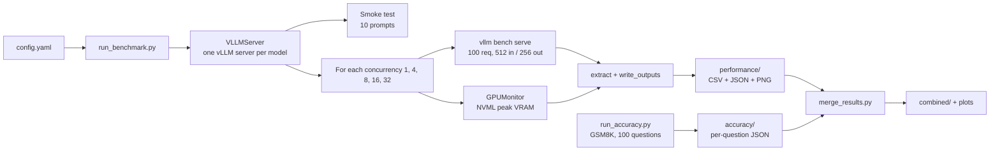
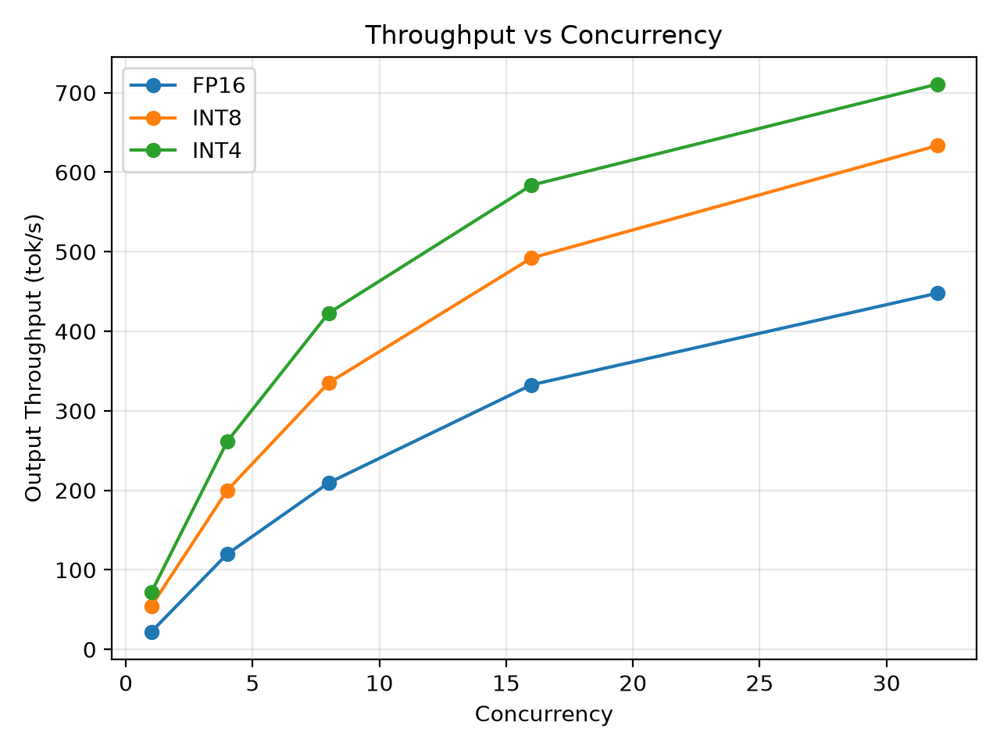
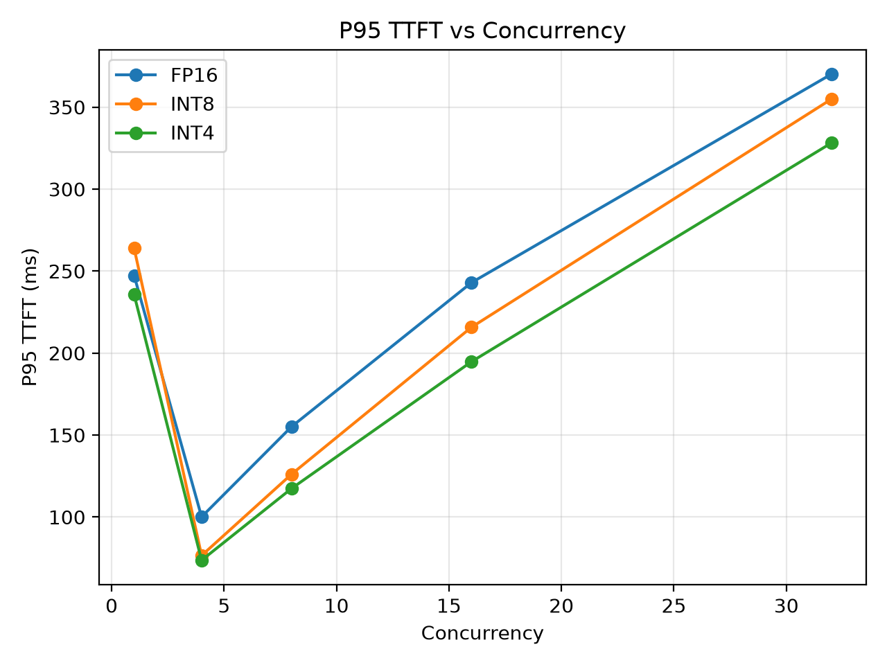
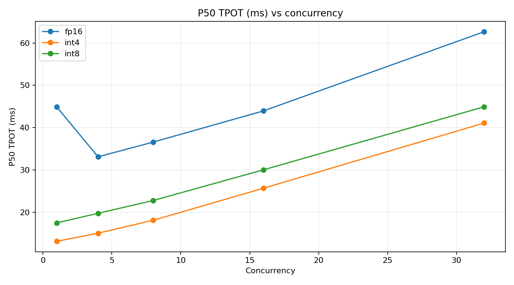
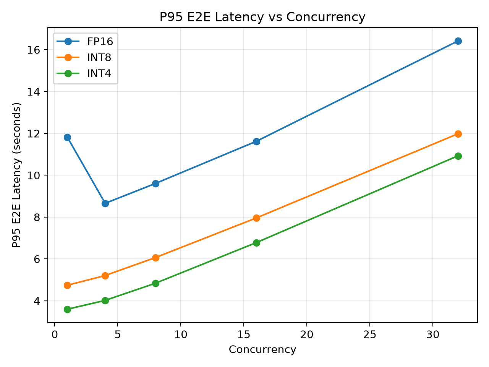
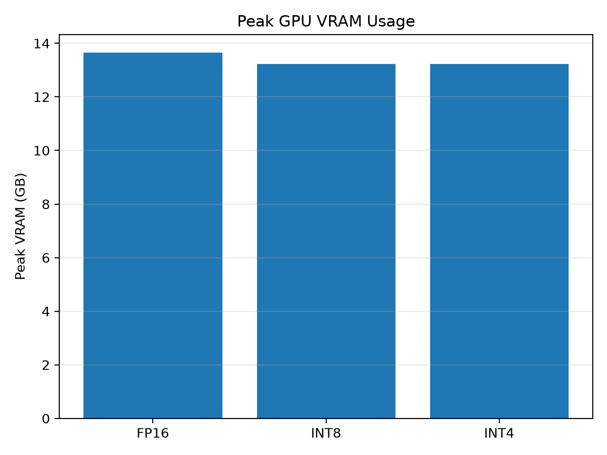
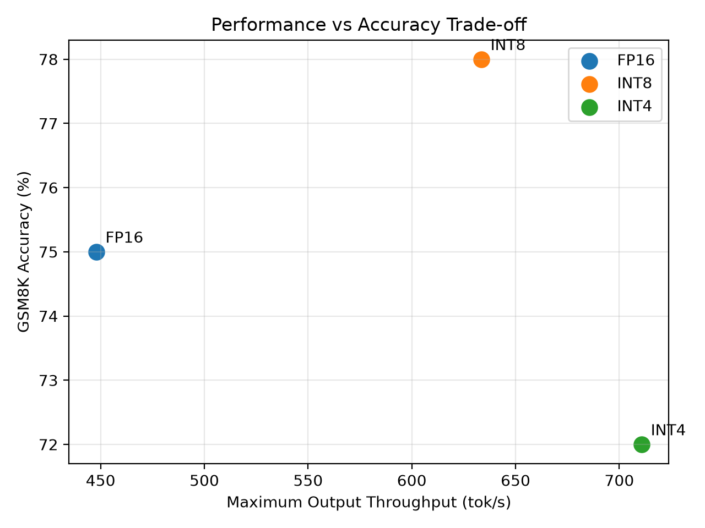

# Quantization Performance Benchmark

**FP16 vs GPTQ INT8 vs GPTQ INT4 for LLM serving with vLLM, measured on a Tesla T4.**

A reproducible, production-style benchmark that serves the same model (`Qwen2.5-3B-Instruct`) in three precisions under one identical vLLM protocol, and measures **throughput, latency (TTFT / TPOT / ITL / E2E at P50-P95-P99), GPU memory, failure rate, cost and accuracy** across five concurrency levels (1 to 32).

<!-- Image not yet committed (docs/images is empty):  -->

---

## Table of contents

1. [Key findings (TL;DR)](#1-key-findings-tldr)
2. [What this project does](#2-what-this-project-does)
3. [Experimental setup](#3-experimental-setup)
4. [Project structure and pipeline](#4-project-structure-and-pipeline)
5. [How to run it](#5-how-to-run-it)
6. [Results: serving performance](#6-results-serving-performance)
7. [Results: accuracy (GSM8K)](#7-results-accuracy-gsm8k)
8. [Analysis and recommendations](#8-analysis-and-recommendations)
9. [Methodology caveats and known issues (read before citing)](#9-methodology-caveats-and-known-issues-read-before-citing)
10. [Roadmap](#10-roadmap)
11. [Artifact index](#11-artifact-index)
12. [Appendix: full result tables](#12-appendix-full-result-tables)
13. [Credits](#13-credits)

---

## 1. Key findings (TL;DR)

| Metric | FP16 | GPTQ INT8 | GPTQ INT4 |
|---|---:|---:|---:|
| Model weights in GPU memory | 5.79 GiB | 3.27 GiB (-44%) | **1.94 GiB** (-66%) |
| KV-cache capacity (same 0.90 budget) | 187,744 tokens | 247,936 (+32%) | **287,360** (+53%) |
| Output throughput, C=1 | 22.0 tok/s | 54.3 | **71.5** |
| Output throughput, C=32 | 447.9 tok/s | 633.5 (+41%) | **710.8** (+59%) |
| P50 TPOT, C=32 | 62.7 ms | 44.9 ms | **41.1 ms** |
| P95 end-to-end latency, C=32 | 16.42 s | 11.98 s | **10.93 s** |
| Compute cost per 1M output tokens, C=32 | $0.217 | $0.153 | **$0.137** |
| GSM8K accuracy, as scored (n=100) | 75% | **78%** | 72% |
| GSM8K accuracy, numeric match (n=100) | 83% | **84%** | 81% |
| Failed requests (5 runs x 100 requests) | 0 / 500 | 0 / 500 | 0 / 500 |

*Percentages in parentheses are relative to FP16. Bold = best of the three. C = number of concurrent requests. The bold GSM8K values are point estimates only: the accuracy differences are **not statistically significant** ([section 7.3](#73-how-much-of-the-difference-is-signal)).*

**What the data says**

1. **Quantization makes serving substantially faster on this GPU.** At C=4 to C=32, GPTQ INT8 delivers **1.41-1.67x** and GPTQ INT4 **1.59-2.18x** the output throughput of FP16. INT4 is fastest at every concurrency level and on every latency metric.
2. **Memory savings are real but are hidden by the usual "peak VRAM" metric.** Weights shrink from 5.79 GiB to 3.27 GiB (INT8) and 1.94 GiB (INT4). Because vLLM fills its fixed 0.90 budget with KV cache, the freed memory shows up as **+32% / +53% more KV-cache capacity**, not as lower `nvidia-smi` usage (see [section 6.3](#63-gpu-memory)).
3. **Accuracy is statistically indistinguishable in this test, but INT4 shows a behavioural change.** GSM8K scores (n=100) are 75 / 78 / 72%, and every pairwise difference is well inside sampling noise (all McNemar p > 0.3). However, INT4 failed to follow the required `FINAL:` output format in **11/100** answers versus **0/100** for FP16, and wrote ~12% longer answers.
4. **Cost per generated token falls by 29% (INT8) and 37% (INT4) at C=32**, from $0.217 to $0.153 and $0.137 per million output tokens (at an assumed $0.35 per GPU-hour).
5. **Reliability was perfect:** 1,500 requests across 15 configurations, 0 failures.

> [!WARNING]
> Three measurement issues limit how far these numbers can be pushed: (a) **prefix caching made ~97% of prompt tokens free for every run after the first**, so TTFT at C>=4 is *not* a cold-prefill measurement; (b) **FP16 at C=1 is anomalously slow** (44.9 ms/token vs 33.1 ms at C=4), which inflates the C=1 speed-ups; (c) accuracy uses **n=100** questions and a **single repetition** of every performance run. Details, evidence and fixes are in [section 9](#9-methodology-caveats-and-known-issues-read-before-citing).

---

## 2. What this project does

The project answers one practical question: **"If I serve this model with GPTQ INT8 or INT4 instead of FP16, what do I gain and what do I risk?"** It deliberately avoids declaring a winner from throughput alone and reports the six things a production decision needs:

1. Accuracy / quality
2. P95 / P99 latency
3. Sustained output throughput
4. VRAM / KV-cache capacity
5. Failure rate
6. Cost per useful output token

**What is measured**

| Area | Metrics |
|---|---|
| Latency | TTFT, TPOT, ITL, E2E latency, each at mean / P50 / P95 / P99 |
| Throughput | requests/s, output tokens/s, total (input+output) tokens/s |
| Reliability | completed requests, failed requests, error rate |
| Memory | peak GPU memory (NVML, sampled every 0.2 s), plus weights/KV-cache from vLLM logs |
| Cost | estimated GPU cost from wall time and an hourly price |
| Scaling | concurrency sweep 1, 4, 8, 16, 32 |
| Quality | 10-prompt API smoke test and a 100-question GSM8K evaluation |
| Outputs | CSV, JSON, PNG charts, raw vLLM results, server logs |

---

## 3. Experimental setup

### 3.1 Hardware and software

| Component | Value |
|---|---|
| Platform | Kaggle notebook (Linux 6.18.48, Python 3.13.15) |
| GPU | **NVIDIA Tesla T4** (Turing, compute capability 7.5, 15,360 MiB, 70 W). Two T4s were visible; **only GPU 0 was used** (`CUDA_VISIBLE_DEVICES=0`) |
| Driver / CUDA | 580.178.04 / CUDA 13.0 |
| Serving engine | **vLLM 0.31.0** (V1 engine, V2 model runner) |
| PyTorch / Transformers | 2.13.0+cu130 / 5.16.1 |
| Attention backend | `TRITON_ATTN` (FlashAttention-2 requires compute capability >= 8.0, so it is unavailable on a T4) |
| Quantized linear kernel | `MarlinLinearKernel` for both GPTQ INT8 and INT4 (reported in the vLLM logs) |
| Run date | 2026-10-08 (performance and accuracy were separate sessions with the same vLLM version and server flags) |

### 3.2 Models

| Name in results | Checkpoint | Method | Weights in GPU memory |
|---|---|---|---:|
| `fp16` | `Qwen/Qwen2.5-3B-Instruct` | none, dtype float16 | 5.79 GiB |
| `int8` | `Qwen/Qwen2.5-3B-Instruct-GPTQ-Int8` | GPTQ 8-bit (real quantized checkpoint) | 3.27 GiB |
| `int4` | `Qwen/Qwen2.5-3B-Instruct-GPTQ-Int4` | GPTQ 4-bit (real quantized checkpoint) | 1.94 GiB |

The quantized models are genuine GPTQ checkpoints, not an INT8/INT4 label applied to an FP16 model. All three are served under the same name (`quant-benchmark-model`) with `--dtype float16`.

### 3.3 Workload and server settings

| Parameter | Value |
|---|---|
| Endpoint / backend | `/v1/chat/completions`, `vllm bench serve --backend openai-chat` |
| Dataset | `random` (synthetic random-token prompts) |
| Input length | 512 random tokens (~541 after the chat template; 54,100 prompt tokens per run) |
| Output length | 256 tokens (exactly 25,600 generated tokens per run, in all 15 runs) |
| Requests per concurrency point | 100 (plus 10 warm-up requests) |
| Concurrency levels | 1, 4, 8, 16, 32 (`--max-concurrency`) |
| Arrival process | `--request-rate inf` (closed-loop saturation) |
| Sampling | `temperature=0`, `seed=42` |
| Repetitions | 1 |
| `gpu_memory_utilization` | 0.90 |
| `max_model_len` | 4096 |
| CUDA graphs / torch.compile | enabled (`enforce_eager: false`), mode `FULL_AND_PIECEWISE` |
| Prefix caching, chunked prefill | enabled (vLLM defaults; see [caveat 9.1](#91-prefix-caching-inflated-ttft-for-every-run-after-the-first)) |
| Cost assumption | $0.35 per GPU-hour |

### 3.4 Metric definitions

| Metric | Meaning |
|---|---|
| **TTFT** | Time to first token: request sent to first generated token (queueing + prefill) |
| **TPOT** | Time per output token, excluding the first token: `(E2E - TTFT) / (output_tokens - 1)` |
| **ITL** | Inter-token latency: gap between consecutive streamed tokens |
| **E2E** | End-to-end latency of one request |
| **Output throughput** | Generated tokens per second across all concurrent requests |
| **Peak VRAM** | Maximum `used` memory on GPU 0 from NVML while a run is active |
| **Estimated cost** | `wall_time / 3600 x gpu_hourly_usd` (benchmark compute only) |

---

## 4. Project structure and pipeline

```text
quant-benchmark/
├── README.md                     <- this file
├── config.yaml                   <- single source of truth: models, workload, server flags, cost
├── requirements.txt
├── run_benchmark.py              <- main entry point: serve -> smoke test -> concurrency sweep -> outputs
├── run_accuracy.py               <- GSM8K evaluation driver (starts a server per model)
├── benchmark/
│   ├── server.py                 <- VLLMServer: launches/health-checks/stops `vllm serve`
│   ├── vllm_bench.py             <- wraps `vllm bench serve`, saves raw JSON + run metadata
│   ├── memory.py                 <- GPUMonitor: NVML polling thread (0.2 s) for peak VRAM
│   ├── system.py                 <- environment capture (GPU, vLLM/torch/transformers versions)
│   ├── accuracy.py               <- 10-prompt deterministic API smoke test
│   └── results.py                <- metric extraction, CSV/JSON writers, per-metric charts
├── resultcode/
│   ├── merge_results.py          <- joins performance CSV with GSM8K summary -> combined/
│   └── make_plots.py             <- 5 combined charts
├── notebook/
│   └── quantization-performance-benchmark.ipynb   <- the Kaggle session that produced the results
├── profiling/README.md           <- plan for Nsight follow-up (profiling is intentionally kept out of the main run)
├── docs/                         <- (figures and derived_metrics.json not yet committed, see 9.8)
└── merged-results/
    ├── performance/              <- benchmark_results.csv, benchmark_aggregate.csv, environment.json,
    │   └── raw/                     run_config.json, accuracy.json (smoke), PNG charts, raw vLLM JSON, server logs
    ├── accuracy/results/accuracy/<- gsm8k_{fp16,int8,int4}.json (per-question records), final summary, server logs
    └── combined/                 <- combined_results.csv/json + plots/
```



**Execution flow of `run_benchmark.py`**

1. Load `config.yaml`, create `results/raw/`, record the environment and a copy of the config.
2. For each model in `quantization.methods`: start `vllm serve` as a subprocess, poll `/health` (up to 900 s), and write the server log.
3. Run the 10-prompt smoke test (`benchmark/accuracy.py`) against the live server.
4. For each repetition and each concurrency level: start `GPUMonitor`, run `vllm bench serve` (saving the raw JSON), stop the monitor, and extract a flat row of metrics plus wall time and estimated cost.
5. Always stop the server (`finally`), so GPU memory is released before the next model.
6. Write `benchmark_results.csv`, `benchmark_aggregate.csv` (mean/std across repetitions), `environment.json`, `accuracy.json` and six PNG charts.

---

## 5. How to run it

### Requirements

An NVIDIA GPU with enough memory for the 3B FP16 model (about 6 GB of weights), CUDA, and Python. Dependencies are in `requirements.txt` (`vllm[bench]`, `openai`, `aiohttp`, `requests`, `pyyaml`, `pandas`, `matplotlib`, `nvidia-ml-py`). The GSM8K evaluator additionally needs `datasets`.

### Performance benchmark

```bash
pip install -r requirements.txt
export CUDA_VISIBLE_DEVICES=0
python run_benchmark.py          # writes results/ (CSV, JSON, PNG, raw JSON, server logs)
```

Kaggle:

```python
import os
os.environ["CUDA_VISIBLE_DEVICES"] = "0"
%cd /kaggle/working/quant-benchmark
!pip install -q -r requirements.txt
!python run_benchmark.py
```

The full sweep (3 models x 5 concurrency levels x 100 requests) took about **60 minutes** of benchmark time on the T4 ([section 6.5](#65-cost-and-run-time)).

### Accuracy (GSM8K)

```bash
python run_accuracy.py           # 100 GSM8K test questions per model, writes results/accuracy/
```

> [!NOTE]
> `run_accuracy.py` imports `accuracy_benchmark.evaluate_gsm8k`, a module that was created *inside the notebook* (cell 17) and patched in cells 29-30, and it hard-codes `/kaggle/working/...` paths. See [caveat 9.8](#98-repository-and-notebook-have-drifted-apart).

### Merge, plot and analyse

Copy the generated `results/` files into `merged-results/performance/` and `results/accuracy/` into `merged-results/accuracy/results/accuracy/`, then from the project root:

```bash
python resultcode/merge_results.py     # -> merged-results/combined/combined_results.{csv,json}
python resultcode/make_plots.py        # -> merged-results/combined/plots/*.png
```

### Configuration reference (`config.yaml`)

| Key | Value used | Notes |
|---|---|---|
| `server.gpu_memory_utilization` | 0.90 | Fraction of GPU memory vLLM may use (weights + activations + KV cache) |
| `server.max_model_len` | 4096 | Max context per request |
| `server.enforce_eager` | false | CUDA graphs enabled |
| `benchmark.input_tokens` / `output_tokens` | 512 / 256 | Random dataset lengths |
| `benchmark.num_prompts` / `warmup_prompts` | 100 / 10 | Per concurrency point |
| `benchmark.concurrency_levels` | 1, 4, 8, 16, 32 | `--max-concurrency` |
| `benchmark.request_rate` | `inf` | All requests released as fast as concurrency allows |
| `benchmark.percentiles` | 50, 95, 99 | Reported for TTFT, TPOT, ITL, E2E |
| `benchmark.seed` / `temperature` | 42 / 0 | Determinism |
| `benchmark.repetitions` | 1 | Raise to 3 or more for confidence intervals |
| `accuracy.enabled` / `minimum_score` | true / 0.80 | Smoke-test gate. `accuracy.num_prompts: 20` is currently unused (the smoke test has 10 hard-coded cases) |
| `cost.gpu_hourly_usd` | 0.35 | Used for the cost estimates |

---

## 6. Results: serving performance

All 15 configurations (3 models x 5 concurrency levels) completed **100/100 requests with 0 failures**. Bold marks the best value in each column.

### 6.1 Throughput

Output tokens per second (higher is better):

| Model | C=1 | C=4 | C=8 | C=16 | C=32 |
|---|---:|---:|---:|---:|---:|
| FP16 | 22.0 | 120.0 | 209.5 | 332.8 | 447.9 |
| GPTQ INT8 | 54.3 | 200.1 | 335.2 | 492.2 | 633.5 |
| GPTQ INT4 | **71.5** | **261.6** | **422.9** | **583.7** | **710.8** |



Speed-up of output throughput relative to FP16:

| Model | C=1 | C=4 | C=8 | C=16 | C=32 |
|---|---:|---:|---:|---:|---:|
| GPTQ INT8 | 2.46x | 1.67x | 1.60x | 1.48x | 1.41x |
| GPTQ INT4 | **3.25x** | **2.18x** | **2.02x** | **1.75x** | **1.59x** |

<!-- Image not yet committed (docs/images is empty):  -->

- At **C=32**, INT8 is **+41.4%** and INT4 **+58.7%** faster than FP16, and INT4 is **+12.2%** faster than INT8.
- The advantage **shrinks as concurrency grows** (INT4: 2.18x at C=4 to 1.59x at C=32), which is the expected signature of decoding moving from memory-bandwidth-bound toward compute-bound as batches grow.
- The C=1 speed-ups (2.46x and 3.25x) are inflated by the FP16 C=1 anomaly described in [caveat 9.2](#92-fp16-at-c1-is-anomalously-slow). Prefer the C>=4 figures for headline claims.
- Throughput was **still rising at C=32** for every model (C=16 to C=32: FP16 +34.6%, INT8 +28.7%, INT4 +21.8%), so the true saturation point was not reached. KV-cache usage peaked at only 12.8% (FP16, C=32).

### 6.2 Latency

#### Time to first token (ms, lower is better)

P50:

| Model | C=1 | C=4 | C=8 | C=16 | C=32 |
|---|---:|---:|---:|---:|---:|
| FP16 | 242.4 | 97.5 | 130.8 | 200.7 | 250.6 |
| GPTQ INT8 | 260.0 | 71.2 | 94.9 | 157.8 | 245.5 |
| GPTQ INT4 | **232.8** | **66.3** | **82.7** | **134.7** | **238.8** |

P95:

| Model | C=1 | C=4 | C=8 | C=16 | C=32 |
|---|---:|---:|---:|---:|---:|
| FP16 | 247.3 | 100.1 | 155.1 | 243.0 | 370.1 |
| GPTQ INT8 | 263.9 | 76.5 | 126.1 | 215.8 | 354.9 |
| GPTQ INT4 | **235.7** | **73.6** | **117.4** | **194.8** | **328.1** |



> [!WARNING]
> TTFT at C>=4 benefits from near-total prefix-cache hits and is **not** a cold-prefill figure. Only the C=1 row is an uncached measurement. See [caveat 9.1](#91-prefix-caching-inflated-ttft-for-every-run-after-the-first).

#### Time per output token (ms, lower is better)

P50:

| Model | C=1 | C=4 | C=8 | C=16 | C=32 |
|---|---:|---:|---:|---:|---:|
| FP16 | 44.9 | 33.1 | 36.6 | 44.0 | 62.7 |
| GPTQ INT8 | 17.5 | 19.7 | 22.8 | 30.0 | 44.9 |
| GPTQ INT4 | **13.1** | **15.0** | **18.1** | **25.7** | **41.1** |

P95:

| Model | C=1 | C=4 | C=8 | C=16 | C=32 |
|---|---:|---:|---:|---:|---:|
| FP16 | 45.4 | 33.6 | 37.2 | 44.7 | 63.3 |
| GPTQ INT8 | 17.6 | 20.1 | 23.4 | 30.6 | 46.3 |
| GPTQ INT4 | **13.2** | **15.5** | **18.6** | **26.1** | **42.1** |



TPOT is the cleanest latency signal in this benchmark because it is unaffected by prefix caching. INT4 is **2.2x to 3.4x faster per token than FP16 at C=1-4** and 1.5x faster at C=32.

#### End-to-end latency (seconds, lower is better)

P50:

| Model | C=1 | C=4 | C=8 | C=16 | C=32 |
|---|---:|---:|---:|---:|---:|
| FP16 | 11.69 | 8.53 | 9.46 | 11.39 | 16.28 |
| GPTQ INT8 | 4.72 | 5.11 | 5.92 | 7.79 | 11.78 |
| GPTQ INT4 | **3.58** | **3.90** | **4.72** | **6.68** | **10.69** |

P95:

| Model | C=1 | C=4 | C=8 | C=16 | C=32 |
|---|---:|---:|---:|---:|---:|
| FP16 | 11.81 | 8.66 | 9.61 | 11.62 | 16.42 |
| GPTQ INT8 | 4.74 | 5.21 | 6.07 | 7.96 | 11.98 |
| GPTQ INT4 | **3.60** | **4.02** | **4.84** | **6.78** | **10.93** |



Because each request generates 256 tokens, end-to-end latency is dominated by decoding (TTFT is only about 2-7% of E2E at C=1). The E2E ranking and ratios therefore follow TPOT and are robust to the prefix-caching issue. ITL percentiles and the full P50/P95/P99 grids are in the [appendix](#12-appendix-full-result-tables).

### 6.3 GPU memory

The `gpu_0_peak_vram_mb` column reports **13,975.2 MB for FP16 and 13,543.2 MB for both quantized models, identically in every concurrency run**:



That chart is accurate but uninformative: vLLM pre-allocates whatever fits inside `gpu_memory_utilization x total memory`, so total device usage always lands near 0.90 of 15 GiB regardless of how small the model is. The real memory story is in the vLLM startup logs:

<!-- Image not yet committed (docs/images is empty):  -->

| | FP16 | GPTQ INT8 | GPTQ INT4 |
|---|---:|---:|---:|
| Model weights (`Model loading took`) | 5.79 GiB | 3.27 GiB | 1.94 GiB |
| Activations, CUDA graphs, other (derived) | 0.87 GiB | 1.33 GiB | 1.30 GiB |
| KV cache (`Available KV cache memory`) | 6.45 GiB | 8.51 GiB | 9.87 GiB |
| **Budget** (0.90 x 14.56 GiB) | 13.11 GiB | 13.11 GiB | 13.11 GiB |
| KV-cache capacity | 187,744 tokens | 247,936 tokens | 287,360 tokens |
| Max concurrent 4,096-token requests | 45.84x | 60.53x | 70.16x |
| Peak NVML VRAM (`gpu_0_peak_vram_mb`, every run) | 13,975.2 MB | 13,543.2 MB | 13,543.2 MB |

- Weights shrink by **44% (INT8)** and **66% (INT4)**.
- That freed memory becomes KV cache: **+32% (INT8)** and **+53% (INT4)** more cacheable tokens, i.e. room for more concurrent long-context requests.
- At a 4,096-token context, the server could hold **45.8x / 60.5x / 70.2x** concurrent full-length requests (FP16 / INT8 / INT4).
- Practical meaning: on a smaller GPU (or with a larger model), quantization is what lets the model *fit*; on this GPU it mostly buys concurrency headroom.

### 6.4 Reliability

| Model | Configurations | Requests | Failed | Error rate |
|---|---:|---:|---:|---:|
| FP16 | 5 | 500 | **0** | 0% |
| GPTQ INT8 | 5 | 500 | **0** | 0% |
| GPTQ INT4 | 5 | 500 | **0** | 0% |

### 6.5 Cost and run time

Compute cost per **one million generated tokens**, assuming the GPU is fully used at that concurrency and costs $0.35/hour (output tokens only, lower is better):

| Model | C=1 | C=4 | C=8 | C=16 | C=32 |
|---|---:|---:|---:|---:|---:|
| FP16 | $4.413 | $0.810 | $0.464 | $0.292 | $0.217 |
| GPTQ INT8 | $1.791 | $0.486 | $0.290 | $0.198 | $0.153 |
| GPTQ INT4 | **$1.359** | **$0.372** | **$0.230** | **$0.167** | **$0.137** |

> [!NOTE]
> "Cost per 1M tokens" is computed from steady-state output throughput (`0.35 / 3600 / tok_per_s x 1e6`). The "Est. cost" column in the appendix is computed from wall time, which also includes the 10 warm-up requests, so it is higher per token.

<!-- Image not yet committed (docs/images is empty):  -->

At C=32, INT8 is **29%** and INT4 **37%** cheaper per generated token than FP16. At low concurrency the gap is larger (C=1: $4.41 vs $1.36), but see the FP16 C=1 caveat.

Benchmark run time and cost (wall time includes the 10 warm-up requests; excludes server start-up):

| Model | Wall time (5 runs incl. warm-up) | Estimated GPU cost |
|---|---:|---:|
| FP16 | 1,885 s (31.4 min) | $0.183 |
| GPTQ INT8 | 954 s (15.9 min) | $0.093 |
| GPTQ INT4 | 759 s (12.7 min) | $0.074 |
| **Total** | **3,598 s (60 min)** | **$0.350** |

---

## 7. Results: accuracy (GSM8K)

### 7.1 Evaluation protocol

| Item | Value |
|---|---|
| Dataset | `openai/gsm8k` (`main`), test split, **first 100 questions** (same questions, same order for all models) |
| Prompting | Zero-shot, single user turn, ends with `FINAL: <number>` instruction |
| Decoding | `temperature=0`, `max_tokens=512`, sequential requests |
| Answer extraction | Text after `FINAL:` (first line); falls back to the last number in the output |
| Scoring | **Exact string match** against the reference number after lower-casing and removing commas |

> [!NOTE]
> The notebook shows why `max_tokens=512` matters. An earlier run with the config's `max_tokens=128` scored **3% / 1% / 4%**, almost certainly because answers were cut off before the final line. After raising it to 512 and shortening the prompt, the same pipeline produced the 75 / 78 / 72% reported here.

A separate 10-prompt API smoke test (`benchmark/accuracy.py`) scored **9/10 (90%) for all three models**, so it cannot discriminate between them. It only confirms that every server answers sensibly.

### 7.2 Results

| Model | Correct (as scored) | Accuracy | 95% CI | vs FP16 | Correct (numeric match) | Accuracy | Missing `FINAL:` line | Mean output length |
|---|---:|---:|---|---:|---:|---:|---:|---:|
| FP16 | 75/100 | **75%** | 65.7 - 82.5% | +0 pp | 83/100 | 83% | 0 / 100 | 707 chars |
| GPTQ INT8 | 78/100 | **78%** | 68.9 - 85.0% | +3 pp | 84/100 | 84% | 2 / 100 | 719 chars |
| GPTQ INT4 | 72/100 | **72%** | 62.5 - 79.9% | -3 pp | 81/100 | 81% | 11 / 100 | 795 chars |

<!-- Image not yet committed (docs/images is empty):  -->

*Solid bars: the score as computed by the pipeline. Hatched bars: the same outputs re-scored by comparing the first number in the extracted answer numerically. Error bars: 95% Wilson confidence intervals.*

### 7.3 How much of the difference is signal?

The 3-point gaps look meaningful on the original trade-off chart, but that chart zooms the y-axis to 72-78% and shows no uncertainty:



With n=100 the 95% confidence interval on each score is roughly **+/-8 to 9 percentage points**, and the intervals overlap almost completely. Because all models answered the *same* questions, a paired test is appropriate:

| Comparison | Only first correct | Only second correct | Exact McNemar p (as scored) | Exact McNemar p (numeric match) |
|---|---:|---:|---:|---:|
| FP16 vs INT8 | 2 | 5 | 0.45 | 1.00 |
| FP16 vs INT4 | 14 | 11 | 0.69 | 0.79 |
| INT8 vs INT4 | 16 | 10 | 0.33 | 0.61 |

- No pairwise difference is close to significant (p between 0.33 and 1.0). **The data cannot rank the three models on accuracy.** It supports only the weaker statement that none shows a large collapse.
- The three models agree on most questions: **60/100 correct in all three, 11/100 wrong in all three** (as scored).
- **Scoring is too strict.** Answers such as `20**` (markdown bold), `243.00`, or `} 16.00 \]` were marked wrong although the number is right. Numeric matching recovers 6-9 answers per model (FP16 75 to 83, INT8 78 to 84, INT4 72 to 81), shrinks the spread between models, and leaves the conclusion unchanged.
- **A real behavioural signal:** INT4 omitted the requested `FINAL:` line in **11/100** outputs (INT8: 2, FP16: 0) and produced **~12% longer outputs** on average. Even when its arithmetic holds up, INT4 is somewhat less reliable at following output-format instructions, which matters for any pipeline that parses model output.

### 7.4 Throughput vs accuracy

Putting the two halves together (point estimates only; see the uncertainty above):

| | Max output throughput | GSM8K (as scored) | GSM8K (numeric) | Weights |
|---|---:|---:|---:|---:|
| FP16 | 447.9 tok/s | 75% | 83% | 5.79 GiB |
| GPTQ INT8 | 633.5 tok/s | 78% | 84% | 3.27 GiB |
| GPTQ INT4 | **710.8 tok/s** | 72% | 81% | **1.94 GiB** |

---

## 8. Analysis and recommendations

### 8.1 Why quantization is faster here (interpretation)

Single-stream decoding must read all the weights from GPU memory for every generated token, so it is typically **memory-bandwidth-bound**. A T4 has about 320 GB/s of memory bandwidth, which gives a simple lower bound for per-token time:

| | FP16 | GPTQ INT8 | GPTQ INT4 |
|---|---:|---:|---:|
| Weights (GB) | 6.22 | 3.51 | 2.08 |
| Bandwidth floor: weights / 320 GB/s | 19.4 ms | 11.0 ms | 6.5 ms |
| Measured P50 TPOT, C=1 | 44.9 ms | 17.5 ms | 13.1 ms |
| Measured P50 TPOT, C=4 | 33.1 ms | 19.7 ms | 15.0 ms |
| TPOT ratio vs FP16 at C=4 | 1.00 | 0.60 | 0.45 |
| Weight-size ratio vs FP16 | 1.00 | 0.56 | 0.34 |

*Illustrative only: it uses the T4's published 320 GB/s peak and ignores KV-cache reads, activations, dequantization and kernel overheads.*

The measured TPOT at C=4 tracks the weight-size ratio (INT8: 0.60 measured vs 0.56 weights; INT4: 0.45 vs 0.34), with INT4 landing above its ideal ratio, consistent with extra dequantization work and fixed per-token overheads. This is an interpretation consistent with the data, not a profiled result (see the [profiling plan](profiling/README.md)). It also explains why the speed-up shrinks at high concurrency: larger batches amortize weight reads and shift the bottleneck toward compute, where the T4 (no native FP8/BF16, Turing tensor cores) gets less help from smaller weights.

### 8.2 Which one should you pick?

These are guidelines from this single benchmark; validate on your own task before deploying.

| If you need... | Choose | Why |
|---|---|---|
| Maximum throughput, lowest cost per token, most KV-cache headroom | **GPTQ INT4** | Best on every performance metric; accuracy within noise on GSM8K |
| ...but your application parses structured / formatted output | INT4 **with format validation** | 11/100 outputs ignored the required `FINAL:` format |
| A balanced default | **GPTQ INT8** | 1.4-1.7x throughput, -44% weights, accuracy indistinguishable from FP16, format adherence close to FP16 |
| Maximum fidelity with no ability to evaluate quantized models | FP16 | Reference behaviour, at roughly 1.4-2.2x lower throughput on this GPU |

FP16 did not win any performance metric at any concurrency on this hardware. Whether that holds on Ampere/Hopper GPUs (FlashAttention-2, BF16, faster FP16 kernels) is untested here.

---

## 9. Methodology caveats and known issues (read before citing)

Every item below was found by inspecting the code, raw results and server logs. Impact is rated for the conclusions in this README.

| # | Issue | Impact | Suggested fix |
|---|---|---|---|
| [9.1](#91-prefix-caching-inflated-ttft-for-every-run-after-the-first) | Prefix caching + identical prompts every run | **High** for TTFT at C>=4; low for throughput/E2E | `--no-enable-prefix-caching`, or vary the seed per run |
| [9.2](#92-fp16-at-c1-is-anomalously-slow) | FP16 C=1 decode slower than FP16 C=4 | **Medium**: inflates C=1 speed-ups | Repeat the C=1 run, log GPU clocks |
| [9.3](#93-peak-vram-measures-the-budget-not-the-need) | Peak VRAM reflects the budget, not the model | Medium | Report weights/KV cache from logs (done here) |
| [9.4](#94-single-repetition-no-error-bars-on-performance) | `repetitions: 1` | Medium | Set `repetitions: 3` |
| [9.5](#95-small-accuracy-sample) | GSM8K n=100 | **High** for accuracy ranking | Full 1,319-question test set |
| [9.6](#96-strict-answer-matching) | Exact-string answer matching | Low-medium | Numeric comparison, strip markdown |
| [9.7](#97-smoke-test-and-config-mismatches) | Smoke test saturated; config keys unused | Low | Retire or harden smoke test |
| [9.8](#98-repository-and-notebook-have-drifted-apart) | Repo vs notebook drift | Reproducibility | Commit `accuracy_benchmark.py`, remove hard-coded paths |
| [9.9](#99-environment-capture-bug) | `environment.json` has no GPU name | Low | `pynvml` returns `str`, drop `.decode()` |
| [9.10](#910-scope-limits) | One model, one GPU generation, synthetic prompts | Scope | See roadmap |

### 9.1 Prefix caching inflated TTFT for every run after the first

vLLM's engine config in the logs shows `enable_prefix_caching=True`, and every `vllm bench serve` call uses `--seed 42` on the `random` dataset. Within one server, the 100 benchmark prompts are therefore the **same at every concurrency level**, and the KV cache (188k-287k tokens) is large enough to keep all 54k prompt tokens resident. The engine's own 10-second logs confirm it. Summing the logged prompt-token throughput over each run's time window gives an estimate (accurate to within one log interval) of the tokens actually prefilled:

| Run | FP16 | GPTQ INT8 | GPTQ INT4 |
|---|---:|---:|---:|
| C=1 | 52,840 | 52,843 | 52,840 |
| C=4 | 1,430 | 1,430 | 1,955 |
| C=8 | 1,430 | 1,430 | 1,482 |
| C=16 | 1,430 | 1,430 | 1,430 |
| C=32 | 1,430 | 1,378 | 1,430 |
| *Prompt tokens sent per run* | *54,100* | *54,100* | *54,100* |

<!-- Image not yet committed (docs/images is empty):  -->

So **C=1 prefilled ~52.8k tokens, while every later run prefilled only ~1.4k (about 97% fewer)**. This explains why P50 TTFT *drops* when concurrency rises from 1 to 4, which would otherwise be impossible:

| Model | P50 TTFT C=1 (cold) | P50 TTFT C=4 (cached) | Change |
|---|---:|---:|---:|
| FP16 | 242.4 ms | 97.5 ms | -60% |
| GPTQ INT8 | 260.0 ms | 71.2 ms | -73% |
| GPTQ INT4 | 232.8 ms | 66.3 ms | -72% |

**Consequences.** The TTFT rows for C>=4 describe a best-case, fully-cached workload plus queueing; they understate real-world TTFT for unique prompts. Throughput, TPOT and E2E conclusions are only slightly affected, because prefill is ~2-7% of a 256-token request. The C=1 TTFT (242 / 260 / 233 ms) is the only honest cold-prefill number, and it shows **no TTFT benefit from quantization worth claiming**: INT8 is 7% *slower* than FP16 and INT4 4% faster, consistent with prefill being compute-bound. The cause is inferred from the log evidence above plus the config, not from a controlled A/B run.

### 9.2 FP16 at C=1 is anomalously slow

FP16 P50 TPOT is **44.9 ms at C=1 but 33.1 ms at C=4**, whereas INT8 and INT4 increase monotonically with concurrency, as expected. Engine-reported decode throughput during the FP16 C=1 run was essentially flat (22-24 tok/s across the run), so it is not a warm-up transient or a drift within the run. A second, independent measurement agrees: the sequential GSM8K evaluation (batch size 1, about four hours later) took **982 s for FP16 vs 394 s for INT8 and 323 s for INT4** (2.5x and 3.0x), similar to the C=1 TPOT ratios (2.6x and 3.4x). The slowdown therefore looks reproducible for batch-size-1 FP16 on this stack rather than a one-off glitch, but its cause is **unexplained**. Untested hypotheses: an inefficient batch-1 FP16 GEMV path on Turing versus the Marlin kernels, or shared-host effects. Treat the C=1 speed-ups (2.46x, 3.25x) as an upper bound.

### 9.3 Peak VRAM measures the budget, not the need

See [section 6.3](#63-gpu-memory). The original `vram.png` / `vram_by_quantization.png` differ by only ~432 MB, which says nothing about model size. The notebook's own write-up already notes that the number is not weight size. Use the weights and KV-cache figures instead. The CSV also records a constant 448 MB for GPU 1 (`gpu_1_peak_vram_mb`); the benchmark did not use that GPU.

### 9.4 Single repetition, no error bars on performance

`repetitions: 1`, so `benchmark_aggregate.csv` contains means with undefined standard deviations. Run-to-run variance on a shared Kaggle GPU is unknown; differences of a few percent (for example INT4 vs INT8 TTFT at C=32) should not be over-interpreted. Latency percentiles within a run are tight (P50 to P95 spreads are typically under 5% at C=1).

### 9.5 Small accuracy sample

100 questions give a 95% interval of roughly +/-8-9 points. The ranking INT8 > FP16 > INT4 is **not** statistically supported ([section 7.3](#73-how-much-of-the-difference-is-signal)). The questions are the first 100 of the test set (not a random sample).

### 9.6 Strict answer matching

`predicted == reference` after light normalization marks `20**`, `243.00` and similar as wrong (6-9 false negatives per model). Because the format glitch rates differ by model (INT4 more often skips the `FINAL:` line), strict matching can bias the comparison slightly against INT4.

### 9.7 Smoke test and config mismatches

The smoke test has 10 fixed trivia/arithmetic cases and scored 9/10 for all models (no discriminating power). `accuracy.num_prompts: 20` and `accuracy.max_tokens: 128` in `config.yaml` do not match behaviour: the smoke test ignores `num_prompts`, and the GSM8K run overrides `max_tokens` to 512 inside `accuracy_benchmark.py`.

### 9.8 Repository and notebook have drifted apart

- `run_accuracy.py` imports `accuracy_benchmark`, which exists only as notebook cell 17 (`%%writefile`) and was patched in cells 29-30 (`max_tokens=512`, shortened prompt).
- `run_accuracy.py` hard-codes `/kaggle/working/quant-benchmark` paths and `num_samples=100`.
- Notebook cell 22 rewrites `benchmark/server.py` to launch `python -m vllm.entrypoints.cli.main serve`; the repository copy still calls the `vllm` executable.
- `datasets` is needed by the GSM8K evaluator but is not listed in `requirements.txt`.
- The generated output directory is `results/`, while the shipped, merged artifacts live in `merged-results/` (assembled by hand from two Kaggle sessions).
- `resultcode/make_analysis.py`, `docs/derived_metrics.json` and all `docs/images/*.png` referenced in earlier versions of this README are **not committed**; the derived numbers (speed-ups, cost, memory, prefix-cache estimates, McNemar tests) were computed offline and are reproducible by hand from the raw CSV/JSON and server logs. The corresponding image lines above are commented out until the figures are added.

### 9.9 Environment capture bug

`environment.json` records `{"error": "'str' object has no attribute 'decode'"}` instead of the GPU name: newer `nvidia-ml-py` returns `str`, but `benchmark/system.py` calls `.decode()`. The GPU is identified here from `nvidia-smi` output in the notebook and from the server logs (compute capability 7.5).

### 9.10 Scope limits

One 3B model, one GPU generation (Turing), vLLM's Triton attention backend, **synthetic random-token prompts** with forced 256-token outputs, GPTQ only (no AWQ, FP8, GGUF). Real traffic with natural-language prompts, variable output lengths, shared system prompts (where prefix caching *should* help) and mixed loads may behave differently.

---

## 10. Roadmap

Highest value first:

1. **Remove the prefix-cache confound**: re-run with `--no-enable-prefix-caching` (or a different seed per concurrency level) and report cold-prefill TTFT.
2. **Add repetitions**: `repetitions: 3` and report mean +/- std; re-run FP16 C=1 and log GPU clocks/temperature to explain the anomaly.
3. **Full GSM8K (1,319 questions)** with a format-tolerant answer parser, plus MMLU or another fixed suite, kept separate from the serving benchmark.
4. **Higher concurrency (64, 128)** to find where throughput saturates; add an open-loop mode (`--request-rate N`) for realistic arrival patterns.
5. **Fix repo drift**: commit `accuracy_benchmark.py`, parameterize paths, add `datasets` to requirements, fix the `.decode()` bug.
6. **Broaden scope**: other model sizes, AWQ / FP8 / GGUF, and an Ampere or Hopper GPU.
7. **Profile one chosen case** with Nsight Systems/Compute as outlined in [`profiling/README.md`](profiling/README.md) (never mix profiled timings into the main CSV).

---

## 11. Artifact index

| Path | Contents |
|---|---|
| `merged-results/performance/benchmark_results.csv` | 15 rows x 29 columns: every metric per (model, concurrency) |
| `merged-results/performance/benchmark_aggregate.csv` | Mean/std across repetitions (std undefined with 1 repetition) |
| `merged-results/performance/raw/*.json` | Raw `vllm bench serve` output per run (aggregates + per-request latencies) |
| `merged-results/performance/raw/server_*.log` | Full vLLM server logs (memory, kernels, per-10 s engine stats). **Note:** `.gitignore` contains `*.log`, so these are excluded from Git unless you remove that rule or force-add them; several findings in section 9 rely on them |
| `merged-results/performance/{throughput,ttft_p50,ttft_p95,tpot_p50,e2e_p95,vram}.png` | Per-metric charts from the pipeline |
| `merged-results/performance/environment.json`, `run_config.json`, `accuracy.json` | Environment, frozen config, 10-prompt smoke test |
| `merged-results/accuracy/results/accuracy/gsm8k_*.json` | Per-question GSM8K records (question, reference, prediction, correctness, full model output) |
| `merged-results/combined/combined_results.{csv,json}` | Performance rows joined with GSM8K results |
| `merged-results/combined/plots/*.png` | 5 combined charts |
| `docs/images/*.png` | *Not yet committed* (generated by a script that is not in the repo) |
| `docs/derived_metrics.json` | *Not yet committed*; all derived numbers in this README are reproducible from the raw files above |

---

## 12. Appendix: full result tables

<details>
<summary><b>TTFT: P50 / P95 / P99 (ms)</b></summary>

| Model | C | P50 TTFT (ms) | P95 TTFT (ms) | P99 TTFT (ms) |
|---|---:|---:|---:|---:|
| FP16 | 1 | 242.4 | 247.3 | 248.1 |
| FP16 | 4 | 97.5 | 100.1 | 108.7 |
| FP16 | 8 | 130.8 | 155.1 | 158.4 |
| FP16 | 16 | 200.7 | 243.0 | 244.6 |
| FP16 | 32 | 250.6 | 370.1 | 410.6 |
| GPTQ INT8 | 1 | 260.0 | 263.9 | 264.8 |
| GPTQ INT8 | 4 | 71.2 | 76.5 | 79.4 |
| GPTQ INT8 | 8 | 94.9 | 126.1 | 130.4 |
| GPTQ INT8 | 16 | 157.8 | 215.8 | 220.1 |
| GPTQ INT8 | 32 | 245.5 | 354.9 | 398.4 |
| GPTQ INT4 | 1 | 232.8 | 235.7 | 237.3 |
| GPTQ INT4 | 4 | 66.3 | 73.6 | 74.4 |
| GPTQ INT4 | 8 | 82.7 | 117.4 | 119.8 |
| GPTQ INT4 | 16 | 134.7 | 194.8 | 201.3 |
| GPTQ INT4 | 32 | 238.8 | 328.1 | 328.9 |

</details>

<details>
<summary><b>TPOT: P50 / P95 / P99 (ms)</b></summary>

| Model | C | P50 TPOT (ms) | P95 TPOT (ms) | P99 TPOT (ms) |
|---|---:|---:|---:|---:|
| FP16 | 1 | 44.9 | 45.4 | 45.5 |
| FP16 | 4 | 33.1 | 33.6 | 33.9 |
| FP16 | 8 | 36.6 | 37.2 | 37.2 |
| FP16 | 16 | 44.0 | 44.7 | 44.7 |
| FP16 | 32 | 62.7 | 63.3 | 63.5 |
| GPTQ INT8 | 1 | 17.5 | 17.6 | 17.6 |
| GPTQ INT8 | 4 | 19.7 | 20.1 | 20.2 |
| GPTQ INT8 | 8 | 22.8 | 23.4 | 23.4 |
| GPTQ INT8 | 16 | 30.0 | 30.6 | 30.7 |
| GPTQ INT8 | 32 | 44.9 | 46.3 | 46.4 |
| GPTQ INT4 | 1 | 13.1 | 13.2 | 13.2 |
| GPTQ INT4 | 4 | 15.0 | 15.5 | 15.5 |
| GPTQ INT4 | 8 | 18.1 | 18.6 | 18.6 |
| GPTQ INT4 | 16 | 25.7 | 26.1 | 26.2 |
| GPTQ INT4 | 32 | 41.1 | 42.1 | 42.1 |

</details>

<details>
<summary><b>ITL: P50 / P95 / P99 (ms)</b></summary>

| Model | C | P50 ITL (ms) | P95 ITL (ms) | P99 ITL (ms) |
|---|---:|---:|---:|---:|
| FP16 | 1 | 45.0 | 47.0 | 47.7 |
| FP16 | 4 | 33.2 | 34.3 | 34.7 |
| FP16 | 8 | 36.6 | 37.9 | 38.6 |
| FP16 | 16 | 43.9 | 46.2 | 47.5 |
| FP16 | 32 | 62.3 | 66.5 | 68.2 |
| GPTQ INT8 | 1 | 17.5 | 18.2 | 18.5 |
| GPTQ INT8 | 4 | 19.8 | 20.6 | 21.0 |
| GPTQ INT8 | 8 | 22.8 | 24.2 | 24.7 |
| GPTQ INT8 | 16 | 29.8 | 32.5 | 34.7 |
| GPTQ INT8 | 32 | 44.6 | 48.9 | 50.8 |
| GPTQ INT4 | 1 | 13.1 | 13.6 | 13.9 |
| GPTQ INT4 | 4 | 15.1 | 16.0 | 16.4 |
| GPTQ INT4 | 8 | 18.1 | 19.4 | 20.0 |
| GPTQ INT4 | 16 | 25.4 | 27.5 | 28.7 |
| GPTQ INT4 | 32 | 40.6 | 44.9 | 46.7 |

</details>

<details>
<summary><b>End-to-end latency: P50 / P95 / P99 (s)</b></summary>

| Model | C | P50 E2E (s) | P95 E2E (s) | P99 E2E (s) |
|---|---:|---:|---:|---:|
| FP16 | 1 | 11.69 | 11.81 | 11.85 |
| FP16 | 4 | 8.53 | 8.66 | 8.75 |
| FP16 | 8 | 9.46 | 9.61 | 9.61 |
| FP16 | 16 | 11.39 | 11.62 | 11.62 |
| FP16 | 32 | 16.28 | 16.42 | 16.42 |
| GPTQ INT8 | 1 | 4.72 | 4.74 | 4.76 |
| GPTQ INT8 | 4 | 5.11 | 5.21 | 5.23 |
| GPTQ INT8 | 8 | 5.92 | 6.07 | 6.07 |
| GPTQ INT8 | 16 | 7.79 | 7.96 | 7.96 |
| GPTQ INT8 | 32 | 11.78 | 11.98 | 12.01 |
| GPTQ INT4 | 1 | 3.58 | 3.60 | 3.60 |
| GPTQ INT4 | 4 | 3.90 | 4.02 | 4.02 |
| GPTQ INT4 | 8 | 4.72 | 4.84 | 4.84 |
| GPTQ INT4 | 16 | 6.68 | 6.78 | 6.79 |
| GPTQ INT4 | 32 | 10.69 | 10.93 | 10.93 |

</details>

<details>
<summary><b>Request rate, total token throughput, wall time and cost per run</b></summary>

| Model | C | Requests/s | Output tok/s | Total tok/s (in+out) | Wall time (s) | Est. cost (USD) |
|---|---:|---:|---:|---:|---:|---:|
| FP16 | 1 | 0.086 | 22.0 | 68.6 | 1,272.7 | 0.1237 |
| FP16 | 4 | 0.469 | 120.0 | 373.5 | 258.2 | 0.0251 |
| FP16 | 8 | 0.818 | 209.5 | 652.2 | 160.6 | 0.0156 |
| FP16 | 16 | 1.300 | 332.8 | 1036.0 | 107.1 | 0.0104 |
| FP16 | 32 | 1.750 | 447.9 | 1394.4 | 86.7 | 0.0084 |
| GPTQ INT8 | 1 | 0.212 | 54.3 | 169.0 | 538.7 | 0.0524 |
| GPTQ INT8 | 4 | 0.782 | 200.1 | 623.1 | 162.2 | 0.0158 |
| GPTQ INT8 | 8 | 1.309 | 335.2 | 1043.6 | 107.1 | 0.0104 |
| GPTQ INT8 | 16 | 1.922 | 492.2 | 1532.2 | 78.7 | 0.0077 |
| GPTQ INT8 | 32 | 2.475 | 633.5 | 1972.2 | 66.9 | 0.0065 |
| GPTQ INT4 | 1 | 0.279 | 71.5 | 222.7 | 412.3 | 0.0401 |
| GPTQ INT4 | 4 | 1.022 | 261.6 | 814.4 | 129.0 | 0.0125 |
| GPTQ INT4 | 8 | 1.652 | 422.9 | 1316.7 | 88.1 | 0.0086 |
| GPTQ INT4 | 16 | 2.280 | 583.7 | 1817.3 | 68.7 | 0.0067 |
| GPTQ INT4 | 32 | 2.776 | 710.8 | 2212.8 | 61.1 | 0.0059 |

</details>

---

## 13. Credits

- Models: [Qwen2.5-3B-Instruct](https://huggingface.co/Qwen/Qwen2.5-3B-Instruct) and its [GPTQ-Int8](https://huggingface.co/Qwen/Qwen2.5-3B-Instruct-GPTQ-Int8) / [GPTQ-Int4](https://huggingface.co/Qwen/Qwen2.5-3B-Instruct-GPTQ-Int4) checkpoints by the Qwen team.
- Serving and benchmarking tools: [vLLM](https://github.com/vllm-project/vllm).
- Accuracy dataset: [GSM8K](https://huggingface.co/datasets/openai/gsm8k) (Cobbe et al., 2021).
- Licence: no licence file is included in the project. Add one before publishing, and check the licences of the model checkpoints you use.